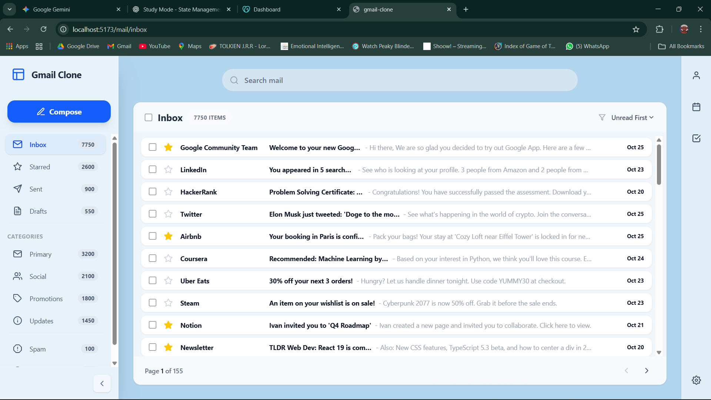

# 📧 Gmail-Like Email Client (Pure Frontend)

This project is a **senior-grade, pure frontend Gmail-like email client** built to demonstrate **real-world frontend engineering skills**, not just UI replication.

The application focuses on **architecture, performance, state management, accessibility, and UX depth**, while intentionally avoiding a backend. Authentication is simulated to demonstrate identity management, and all email data is served from a mocked frontend layer to focus on UI engineering challenges.

---

### 🎯 Project Goals

* Demonstrate **production-ready frontend architecture**.
* Separate **data state, UI state, and routing state** cleanly.
* Handle **large datasets efficiently** (10,000+ items).
* Build a **keyboard-first, accessible user experience**.
* Show how real apps behave **without relying on a backend**.

---

### 🧠 Key Architectural Principles

* **URL = Application State**
    Routes fully describe what the user is viewing (`/mail/inbox`, `/mail/sent`, `/mail/search?q=query`). Refreshing the page never breaks the context, and deep linking works out of the box.

* **Data State vs. UI State**
    * **Data State:** Email data is treated as immutable, server-like data (mocked in `src/data`).
    * **UI State:** Transient behavior (selection, focused row, modal visibility) is managed via global stores (`Zustand`).
    This prevents tight coupling and mirrors real production systems where data comes from an API but UI state is local.

* **Performance First**
    The email list supports **10,000+ emails** using **virtualization** (`react-virtuoso`) to ensure smooth scrolling and instant interaction. We use **Lazy Loading** and **Suspense** to split code chunks and keep the initial bundle size small.

* **UX & Polish**
    We use **Framer Motion** for professional transitions (Splash Screens, Loading States) and **Optimistic UI** patterns to make interactions feel instant.

---

### 🚀 Features

* **Smart Routing:** Inbox, Sent, Drafts, Trash, and Category folders (Social, Updates, Promotions).
* **Virtualization:** Efficient rendering of massive email lists.
* **Keyboard-First:** Vim-style navigation (`j/k`) and bulk actions (`x`, `s`).
* **Bulk Operations:** Multi-select, Delete, Mark as Read/Unread.
* **Search:** URL-driven search filtering.
* **Animations:** Smooth entry transitions and "Hard Loading" states for heavy actions.
* **Responsiveness:** Fluid layout with a collapsible sidebar.

---

### 🧱 Tech Stack

* **Core:** React 18 + TypeScript
* **Build:** Vite
* **Routing:** React Router v6
* **State Management:** Zustand
* **Virtualization:** React Virtuoso
* **Styling:** Tailwind CSS
* **Animations:** Framer Motion
* **Testing:** Vitest + React Testing Library

---

### 🎹 Keyboard Shortcuts

This application is designed for power users. You can navigate the entire inbox without a mouse.

| Key | Action |
| :--- | :--- |
| **`j`** | Move focus **Down** |
| **`k`** | Move focus **Up** |
| **`x`** | **Select/Deselect** the focused email |
| **`s`** | **Star/Unstar** the focused email |
| **`Enter`** | **Open** the focused email |
| **`Esc`** | **Go Back** / Close Modal |

---

### 📌 What This Project Demonstrates

This project is intentionally scoped to the frontend to highlight:

1.  **Architectural thinking** over simple UI cloning.
2.  **Clean separation of concerns** (Hooks vs. UI vs. Store).
3.  **Performance engineering** at scale using virtualization.
4.  **Integration Testing** strategies (testing user flows, not implementation details).

It is designed to reflect how **production email clients work internally**, not just how they look.

---
